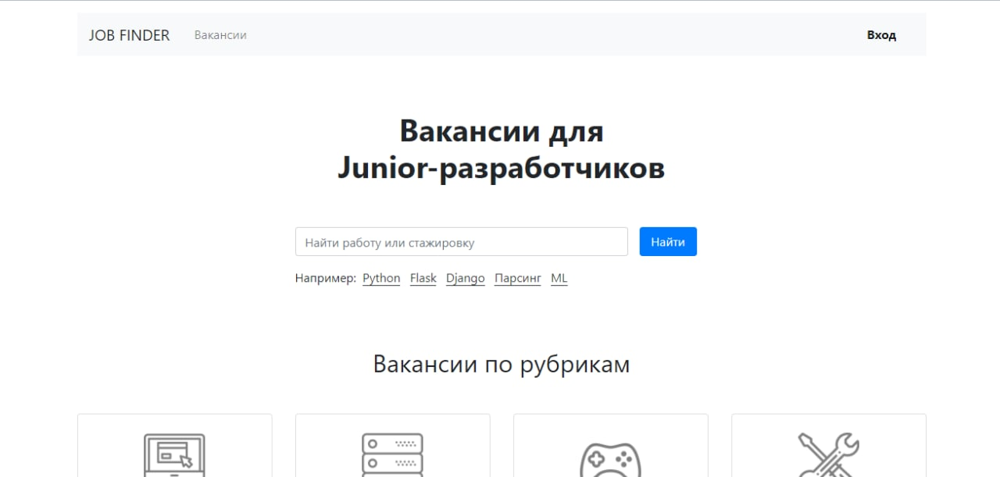
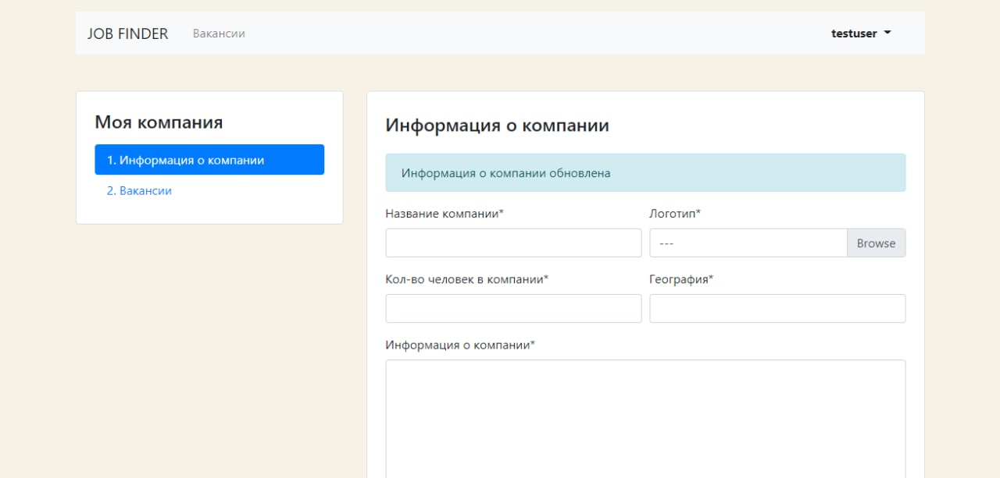
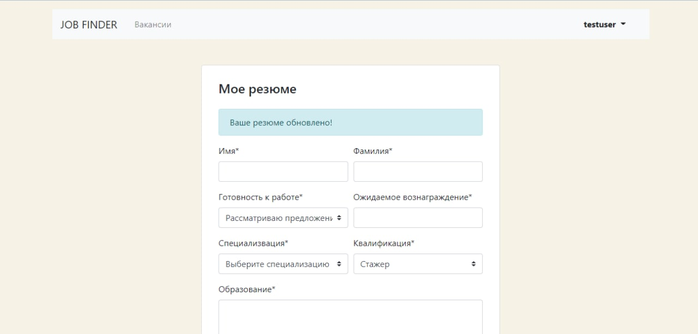
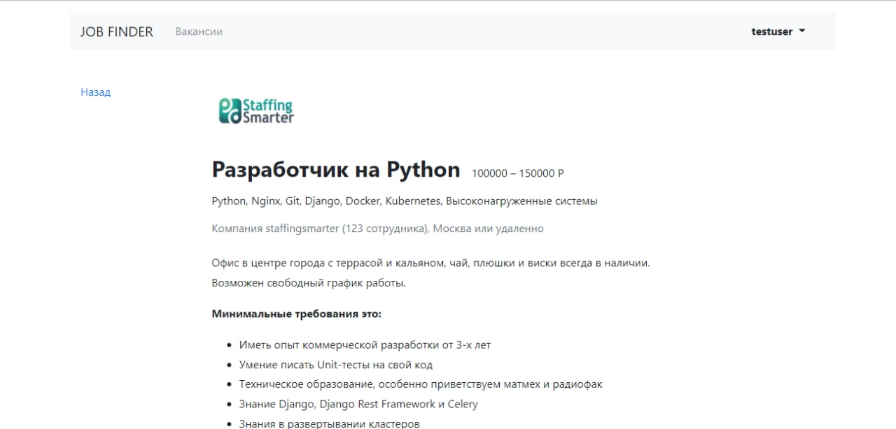

## Three basic things about the project

* The project is aimed at two groups of users: job seekers and employers
* Job seekers can: sign up as a new user / log in / create or update a resume / search for vacancies / respond to a vacancy
* Employers can: sign up as a new user / log in / create or update a company / create or update a vacancy / view those who have responded to the vacancy

### Dependencies

All requirements are listed in the file: `requirements.txt`.

